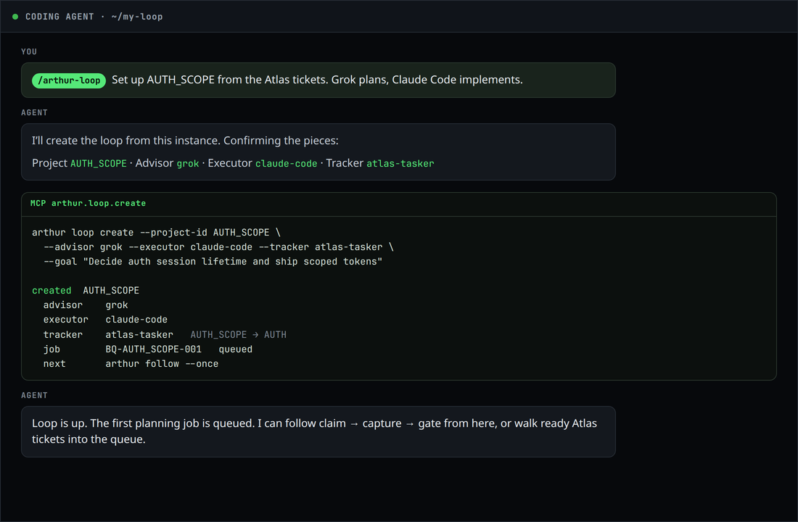
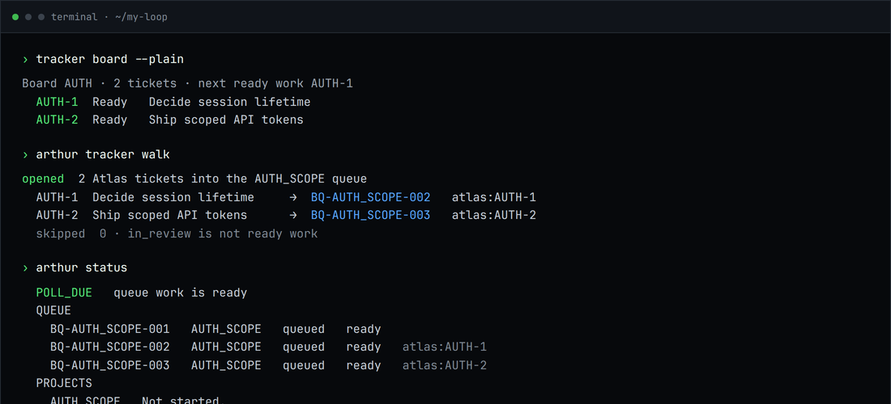
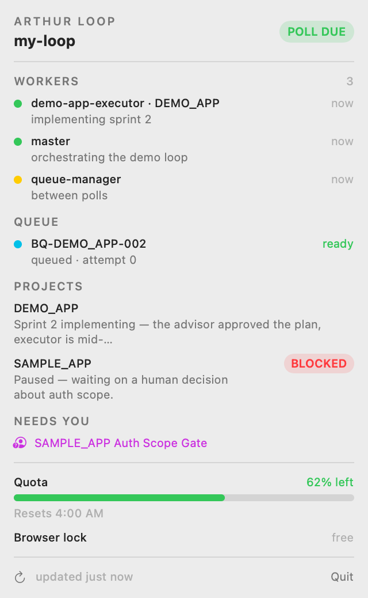
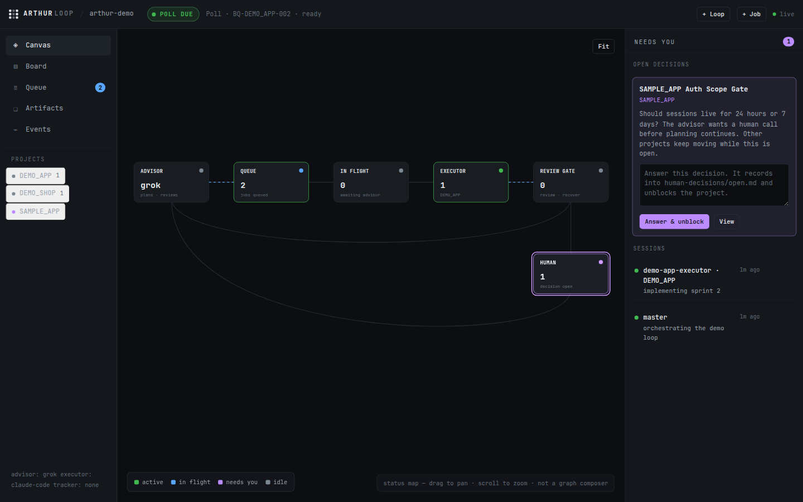

<p align="center">
  
</p>

File-first control plane for AI dev loops — bring your own advisor, executor, and tracker.

<div align="center">
  <a href="https://github.com/myrrazor/arthur-loop/releases/latest"></a>
  
  
  
</div>

Assign agents to **planner**, **implementer**, **reviewer**, and **QA**. Arthur formulates the default hop sequence from your project or ticket and hands each hop to the next role. In an instance, `arthur` runs that next agent.

<p align="center">
  
</p>

<p align="center">
  
  <br>
  <sub><code>/arthur-loop</code> interviews for roles, then calls the same <code>arthur loop create</code> you can type.</sub>
</p>

<p align="center">
  
  <br>
  <sub>Ready <a href="https://github.com/myrrazor/atlas-tasker">Atlas Tasker</a> tickets become queue jobs with <code>arthur tracker walk</code>.</sub>
</p>

<p align="center">
  
  <br>
  <sub>ArthurBar in the macOS menu bar. The badge is 1 because SAMPLE_APP needs a human. Quota is the same meter as <code>arthur status</code>.</sub>
</p>

Site: [arthurloop.com](https://arthurloop.com/). Last tag is **v0.1.0** — `arthur --version` prints that until the next tag.

## Install

```bash
pipx install git+https://github.com/myrrazor/arthur-loop.git

# or with uv
uv tool install git+https://github.com/myrrazor/arthur-loop.git

# or let the installer manage a venv under ~/.arthur-loop
curl -fsSL https://raw.githubusercontent.com/myrrazor/arthur-loop/main/install.sh | sh
```

Then:

```bash
mkdir ~/my-loop && cd ~/my-loop
arthur init
```

Restart the coding agent so MCP connects. `install.ps1` is experimental.

## Assign roles

| Role | Does | Agents |
| --- | --- | --- |
| Planner | Scopes the next packet | `chatgpt-browser` · `claude-code` · `codex` · `grok` · `manual` |
| Implementer | Plans, then builds | `claude-code` · `codex` · `grok` · `manual` |
| Reviewer | Approves the plan and the sprint | same as planner |
| QA | Optional check after implementation | same as planner, or `none` to skip |

Optional model per role (`claude-code:opus`). Missing `roles` in config still maps legacy **advisor** → planner+reviewer and **executor** → implementer.

### Terminal

```bash
arthur roles set reviewer=claude-code:opus qa=grok
arthur loop create --project-id MY_APP --from-ticket AUTH-2 \
  --role planner=grok --role implementer=claude-code --role reviewer=claude-code:opus
arthur                 # next assigned agent
arthur run             # same
arthur run --all       # keep going until idle or gated
arthur follow --once   # same engine
```

Default sequence: planner → implementer (plan) → reviewer → implementer (build) → QA (if assigned) → reviewer (sprint).

### Web console

```bash
arthur web
```

**Roles** assigns agents and models. **+ Loop** creates the project and first hop. **Run next** invokes the next role. Same files as the CLI. Not a graph composer.

<p align="center">
  
</p>

### Agent skill

`/arthur-loop` asks for project, ticket, and the four roles, then calls `arthur.loop.create` and `arthur.run`.

## The macOS menu bar

ArthurBar is a native **menu extra** for macOS 14+. It lives in the [menu bar](https://support.apple.com/guide/mac-help/whats-in-the-menu-bar-mchlp1446/mac) — the strip at the top of the screen — so you can watch workers, the queue, and quota without a terminal or a browser tab in the way.

<p align="center">
  
</p>

An ∞ icon sits with the other menu extras, typically on the right next to Control Center. The number next to it is how many things need a human (open decisions + stale jobs). Click for the status card: workers, queue, projects, remaining quota, and the browser lock. It reads `arthur status --json` and does not change loop state.

The quota bar is the loop’s governor — percent left, reset time, GREEN / YELLOW / RED. Point it at [CodexBar](https://github.com/steipete/CodexBar) (Codex, Claude, and the other subscriptions CodexBar already reads) or at a command or file. At your reserve line the loop checkpoints instead of burning the last 5%.

Want a banner as well as the badge? `arthur watch` posts to Notification Center when a decision opens, quota blocks, work goes due, or a job goes stale.

```bash
cd menubar/ArthurBar && swift build -c release
.build/release/ArthurBar --root ~/my-loop

arthur watch
```

More: [docs/menu-bar.md](docs/menu-bar.md), [menubar/ArthurBar/README.md](menubar/ArthurBar/README.md).

## Manual hop (no agents)

```bash
arthur init --yes --main-agent none --advisor manual --executor manual --tracker none --no-governor
arthur queue create --job-id BQ-MY_APP-001 --project-id MY_APP \
  --target-chat-title "MY_APP planning" --target-chat-url manual \
  --expected-marker HELLO_LOOP --idempotency-key my-app-001
arthur queue claim --job-id BQ-MY_APP-001
arthur queue submit --job-id BQ-MY_APP-001
arthur capture --project-id MY_APP --job-id BQ-MY_APP-001 --kind next-plan-request \
  --source-chat-title manual --source-file queue/manual/done/BQ-MY_APP-001.md
arthur queue poll-result --job-id BQ-MY_APP-001 --marker-found true --status completed
```

## The contract

Files, not a hosted loop. Queue ledger, saved artifacts, implementation gate, project-scoped human decisions, `arthur tick`, `arthur status`. Open decisions, ChatGPT-browser/manual inboxes, and a NO-GO gate stay human.

```bash
arthur status
arthur decision list
arthur gate implementation --project-id MY_APP
```

## FAQ

**Where does the data live?** Markdown and JSONL in the instance directory. The core does not phone home or require an API key.

**Is it free?** MIT. No paid tier.

**Which platforms?** Linux and macOS. Windows experimental. ArthurBar is a macOS 14+ menu extra.

**How do I see the loop from the Mac menu bar?** Build ArthurBar from `menubar/ArthurBar`. The ∞ icon badges when a human decision or stale job needs you. The popover shows workers, queue, projects, remaining quota, and the browser lock. Details: [docs/menu-bar.md](docs/menu-bar.md).

**Why "Arthur"?** A round table of agents. Nobody implements without the crown's approval.

## License

MIT — [LICENSE](LICENSE). Issues: [GitHub](https://github.com/myrrazor/arthur-loop).
