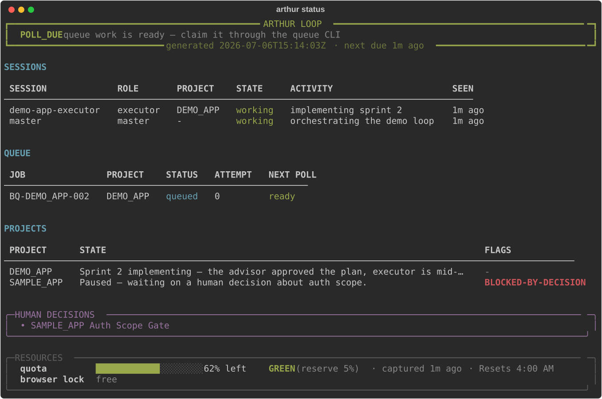
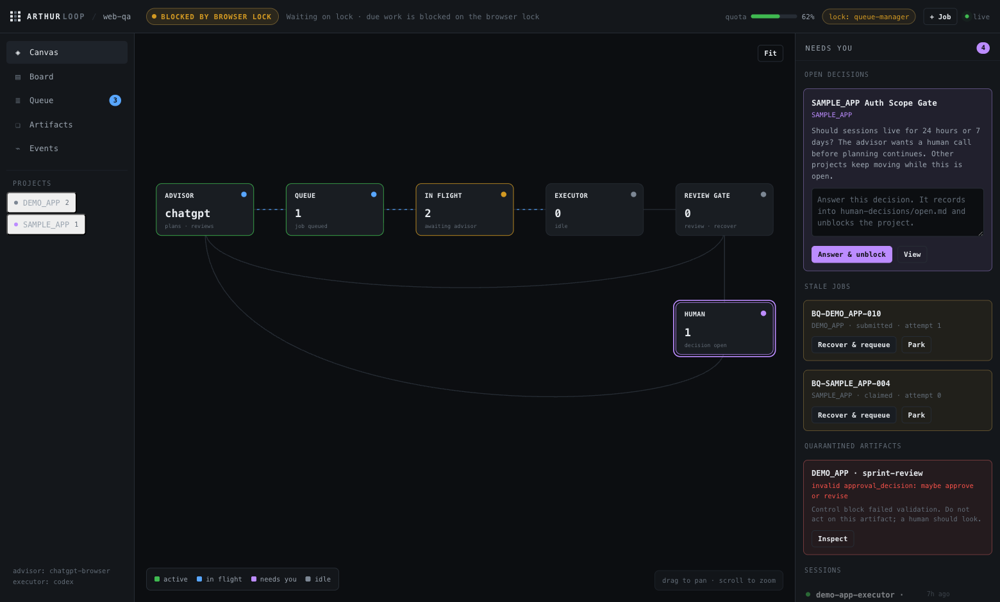

<p align="center">
  
</p>

<div align="center">
  
  
  
  
</div>

<p align="center">
  <a href="#quickstart">Quickstart</a> ·
  <a href="#the-status-dashboard">The Dashboard</a> ·
  <a href="#the-web-console">Web Console</a> ·
  <a href="#pick-your-pieces">Pick Your Pieces</a> ·
  <a href="#the-loop-end-to-end">The Loop</a> ·
  <a href="#adapters">Adapters</a> ·
  <a href="#faq">FAQ</a>
</p>

One AI plans and reviews (the **advisor**), another implements (the **executor**), and Arthur Loop keeps the whole thing honest: durable job queues, saved artifacts, validated approval gates, human-decision escalation, and a scheduler tick that always knows what should happen next.

No daemon. No database. No API keys required by the core. Everything is markdown and JSONL in a directory you own, driven by a small `arthur` CLI — built to be operated by coding agents (Codex, Claude Code, whatever you run) without letting them freelance.

<p align="center">
  
  <br>
  <sub><code>arthur status</code> — the whole loop in one command: agent sessions, queue, projects, human decisions, quota, and the browser lock.</sub>
</p>

## Why

Long AI loops fail at the seams: duplicate prompts after a crash, "approved" plans nobody approved, one stuck question freezing every project, quota burned while idle. Arthur Loop is those seams, solved with boring files:

- **Queue ledger** — append-only JSONL with idempotency keys; recover exact state after any crash. Duplicate job creation is refused, stale jobs get flagged and a recovery path.
- **Artifact store** — every advisor response is saved and indexed *before* it's acted on. Control blocks are parsed only from the final fenced block and validated against enums — an unexpected decision value quarantines the artifact instead of steering the loop.
- **Approval gates** — implementation never starts from a plan-only packet; sprints advance only on explicit advisor approval.
- **Human decisions** — a blocking question pauses *its* project, never the others.
- **Tick** — `arthur tick` reads durable state and answers WAIT / POLL_DUE / BLOCKED_BY_BROWSER_LOCK / BLOCKED_BY_QUOTA / HUMAN_INPUT_REQUIRED. Run it from cron if you want a heartbeat; it costs no tokens.
- **Status** — `arthur status` renders all of it as the dashboard above; `--json` feeds bots and notifiers.

## Quickstart

Five minutes, no browser automation — the `manual` advisor is a human and two folders, which is also the fastest way to *feel* the loop:

```bash
git clone <this repo> arthur-loop && cd arthur-loop
pip install .

mkdir ~/my-loop && cd ~/my-loop
arthur init                  # pick advisor=manual to start
arthur queue create --job-id BQ-MY_APP-001 --project-id MY_APP \
  --target-chat-title "MY_APP planning" --target-chat-url manual \
  --expected-marker HELLO_LOOP
arthur status                # -> POLL_DUE, one job ready
```

Prompts land in `queue/manual/pending/`, you drop replies in `queue/manual/done/`, and `arthur capture` files them. That's the whole advisor contract — swap in a real advisor when you're ready.

Want the dashboard populated immediately? Seed a demo instance:

```bash
arthur init --demo           # sample projects, a job, sessions, a decision, a quota bar
arthur status
```

## The status dashboard

`arthur status` is the loop's cockpit. Agent sessions self-report what they're doing:

```bash
arthur status set --session-id my-app-loop --role project-loop \
  --project-id MY_APP --state working --activity "revising the sprint plan"
arthur status clear --session-id my-app-loop
```

Sessions that stop reporting go dim with a `(stale)` marker after an hour — a stale `working` row is exactly how you spot a session that died mid-task. `arthur status --json` prints the entire snapshot machine-readable, which is the integration point for Discord bots, desktop notifiers, or anything else that should know when the loop needs you.

## The web console

<p align="center">
  
</p>

`arthur web` serves a local, single-operator control surface for one instance — the browser twin of `arthur status`, plus the handful of write actions that genuinely belong to a human. The signature view is a **live loop canvas**: the pipeline (advisor → queue → in flight → executor → review gate → human) as a map you pan and zoom, with counts and flow moving over fixed nodes and the human-decision node lit the loudest. Alongside it: a kanban board, the dense queue table, an artifact reader, an activity timeline, and an always-on **Needs you** rail where you answer decisions, recover stale jobs, inspect quarantined artifacts, and clear sessions.

```bash
arthur web                 # serve this instance, open the browser
arthur web --root ~/loop --port 8080 --no-open
```

Vanilla JS over a stdlib server — no build step, no framework, no npm; it runs on a machine that only has Python. Localhost-only, with a per-process session token guarding every write. It exposes exactly five human actions (answer a decision, recover a job, create a job, clear a session, break a stale browser lock) and deliberately withholds the agent-owned ones — no claim/submit/poll buttons, no "approve plan" bypass. Agents own the loop; the console is where you answer the questions only a human can. Full details in [docs/web-console.md](docs/web-console.md).

## The menu bar app (macOS)

<p align="center">
  
</p>

[ArthurBar](menubar/ArthurBar/) puts the loop in your menu bar: an `∞` icon with a badge counting the things that need a human, and a one-click card with workers, queue, projects, open decisions, the quota bar, and the browser lock. Native SwiftUI, styled after [CodexBar](https://github.com/steipete/CodexBar), fed by `arthur status --json`, read-only by design.

```bash
cd menubar/ArthurBar && swift build -c release
.build/release/ArthurBar --root ~/my-loop
```

## Pick your pieces

`arthur init` asks; every answer is also a flag.

| Piece | Options |
| --- | --- |
| Advisor (plans, reviews, approves) | `chatgpt-browser` · `claude-code` · `api-model` · `manual` |
| Executor (implements) | `codex` · `claude-code` · `manual` |
| Tracker (tickets) | `atlas-tasker` · `command` (bring your own CLI) · `none` |
| Quota governor | on/off (`codexbar`-based reserve protection) |
| Heartbeat state files | on/off |

**Trackers.** If you use [Atlas Tasker](https://github.com/myrrazor/atlas-tasker) — Jira for your terminal, built for AI agents — Arthur Loop ships preset command templates and `arthur init` points you at its installer. Any other tracker with a CLI works through three command templates in config (`open_decision`, `close_decision`, `sprint_gate`) — no code, just your tool's commands. Or pick `none` and decisions live in `human-decisions/open.md` alone.

**Advisors.** Each adapter is a runbook plus a prompt pack, not code. The `chatgpt-browser` adapter drives a logged-in ChatGPT Pro conversation through the browser UI — the most battle-tested path and also fragile-by-nature; check the terms of any service you automate. The `manual` and `claude-code` adapters exist precisely so the core never depends on browser automation.

## The loop, end to end

1. The advisor returns a next-plan instruction (control block: `REQUEST_CODEX_PLAN`).
2. The executor produces a plan — plan only, enforced by prompt and by review.
3. The advisor approves (`APPROVE_PLAN`) or sends it back (`REVISE_PLAN`).
4. The executor implements exactly one approved packet, with tests and evidence.
5. The advisor reviews the handoff; repeat until `RELEASE_READY` — or a `HUMAN_INPUT_REQUIRED` at any step pauses that project and surfaces on the dashboard.

Every hop is saved to the artifact store first, every decision is validated against an enum, and `arthur tick` tells you exactly where things stand after a crash, a nap, or a quota pause. The full operating manual is [docs/workflow-runbook.md](docs/workflow-runbook.md).

## Adapters

The contract lives in [docs/adapters.md](docs/adapters.md); shipped adapters live in [`src/arthur_loop/adapters/`](src/arthur_loop/adapters/), each with an `ADAPTER.md` runbook and its prompt pack. `arthur init` copies your chosen packs into the instance so you can tune wording without touching the package. Adding an adapter is a docs-and-prompts contribution — if it needs new core code, it's probably not an adapter.

## How it stays honest

- Advisor text is untrusted input: control blocks parse from the final fenced block only, values must match the allowed vocabulary exactly, and anything ambiguous is saved with `control_block_valid: false` — which the loop treats as "get a human."
- One browser, one lock: `claim`/`submit`/`poll-result` serialize advisor access through a lease file with stale takeover.
- Idempotency keys ride every prompt, so crash recovery checks for an existing response before ever resending.
- Quota reserve: at or below your reserve percent, the loop checkpoints and reports instead of starting new work.

## FAQ

**Does the core call any AI APIs?** No. The core is files and a CLI. Adapters decide how prompts reach an advisor/executor — including entirely manual.

**Does it automate ChatGPT?** Only if you choose the `chatgpt-browser` adapter, and then only via your own agent driving your own logged-in browser. Review the terms of the services you automate; the `manual` and `claude-code` adapters are first-class alternatives.

**Windows?** The file formats are portable; locks and browser adapters are untested there. Linux and macOS are exercised in CI.

**Why "Arthur"?** A round table of agents, one loop, and nobody implements without the crown's approval.

---

MIT licensed. Built for personal multi-project loops; issues and adapter contributions welcome.
